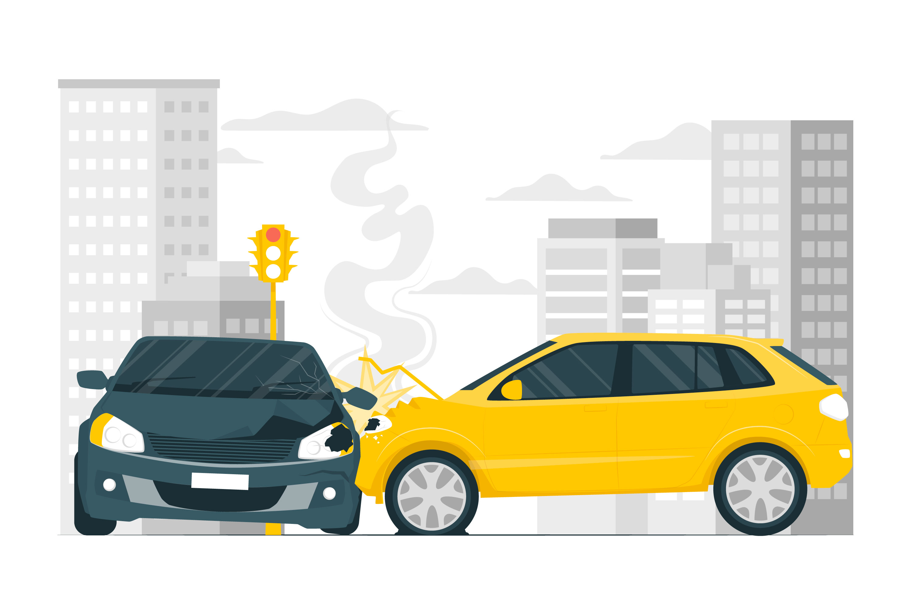

# Road Accident Analysis Dashboard

## Project Overview

This project focuses on analyzing UK road accident data to gain insights into patterns, trends, and key factors contributing to accident occurrences. The primary goal is to identify effective strategies for reducing road accidents by exploring the relationships between variables such as weather conditions, road types, vehicle types, and temporal patterns. By leveraging data-driven insights, this analysis aims to support policymakers and authorities in making informed decisions to enhance road safety measures and ultimately reduce the number of accidents and casualties on UK roads.

## Dataset

The dataset used for this analysis is sourced from the UK Department for Transport and can be accessed [here](https://data.dft.gov.uk/road-accidents-safety-data/dft-road-casualty-statistics-collision-2021.csv). The dataset data guide is also available [here](https://data.dft.gov.uk/road-accidents-safety-data/dft-road-casualty-statistics-collision-2021.csv). The dataset contains comprehensive information on road accidents in the UK, including details such as accident severity, location, date and time, weather conditions, road surface conditions, and vehicle types involved. The dataset covers the time period from January to December 2021.

For more information about the dataset and its variables, please refer to the dataset data guide.

## Data Transformation

The road accident dataset was preprocessed using Power Query to ensure data quality and integrity. The following steps were performed:
  1.  Handling missing values: Rows with missing values, denoted as -1, were removed from the dataset.

  
  
  2.  Converting numerical values to categorical: Columns such as weather conditions, road surface conditions, road type, and number of vehicles were converted from numerical to categorical format for better analysis.
    
   
   

## Data Modelling

No modelling was required since by default the downloaded dataset were in a table and that was used for the analysis

## Analysis and Visualizations

The Road Accident Analysis Dashboard employs various visualization tools and techniques to present key insights and enable users to explore the accident data from different perspectives. The main visualizations used in the dashboard include:

-  **Data Analysis Expressions (DAX):** DAX measures are used to calculate total accident occurrences and severity types, providing aggregate insights into the overall accident landscape.

-  **Stacked Bar Chart:** The stacked bar chart is employed to analyze the distribution of accident severity across different road types, identifying road types associated with higher proportions of fatal, serious, or slight accidents.

-  **Stacked Area Chart:** The stacked area chart investigates the relationship between weather conditions and road surface conditions in accident occurrences, highlighting patterns and correlations between specific weather and road conditions that contribute to accidents.

-  **Heat Map:** The heat map visualizes the geographical distribution of accident incidents across the UK, helping identify accident hotspots and areas requiring targeted interventions.

-  **Cards:** Cards display key metrics such as total accident counts and severity type breakdowns, providing a quick overview of the accident landscape.

-  **Donut Charts:** Donut charts show the distribution of accidents by area (urban, rural), identifying the relative proportions of accidents in different geographical settings.

-  **Slicers and Filters:** The dashboard includes slicers and filters that allow users to interact with the data and focus on specific subsets of interest, enabling customized analysis and exploration.

 
## Key Findings

The analysis revealed several key findings:
-  A total of 37,443 accidents were recorded in 2021, with the majority being slight accidents (77.8%), followed by serious accidents (20.9%) and fatal accidents (1.3%).
-  Most accidents occurred during daylight hours (72.57%) compared to dark periods (27.43%), highlighting the need for increased vigilance and safety measures during peak traffic hours.
-  Urban areas accounted for 69.37% of accidents, while rural areas accounted for 30.62%, indicating a higher concentration of accidents in populated and congested urban settings.
-  Accidents were more frequent during windy conditions, with September being the month with the highest accident count (2,267 incidents), emphasizing the impact of seasonal weather patterns on road safety.
-  Motorcycles were involved in a disproportionately high number of accidents (37,378) compared to other vehicle types, such as buses (2 accidents), highlighting the vulnerability of motorcycle riders and the need for targeted safety initiatives.
-  Police attended the scene in 68.6% (25,672) of the total accidents, demonstrating the importance of prompt emergency response and accident reporting.
-  The heat map analysis identified accident hotspots across various regions, enabling targeted interventions and resource allocation to high-risk areas.

## Recommendations

Based on the analysis and insights derived from the Road Accident Analysis Dashboard, the following recommendations are proposed to enhance road safety and reduce accident occurrences:

-  Implement targeted interventions in high-risk areas, road types, and environmental conditions identified through the analysis.
-  Invest in infrastructure improvements, such as road maintenance, lighting enhancements, and traffic management systems, in areas with higher accident rates.
-  Develop targeted public awareness campaigns to educate road users about safe driving practices and increase caution during adverse weather conditions.
-  Assess the need for stricter vehicle safety regulations, particularly for vulnerable vehicle types like motorcycles.
-  Foster collaborative efforts among government agencies, law enforcement, transportation authorities, and community organizations to implement comprehensive road safety strategies.

By leveraging the insights derived from this Road Accident Analysis Dashboard, policymakers and authorities can make data-driven decisions to enhance road safety, reduce accident rates, and ultimately save lives.

